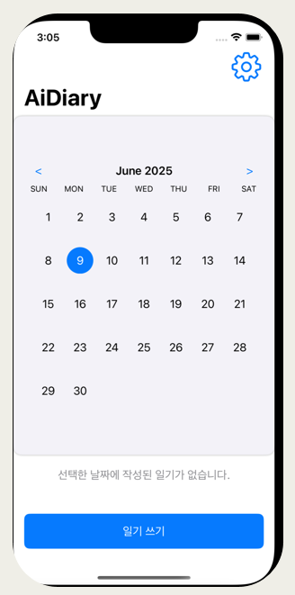
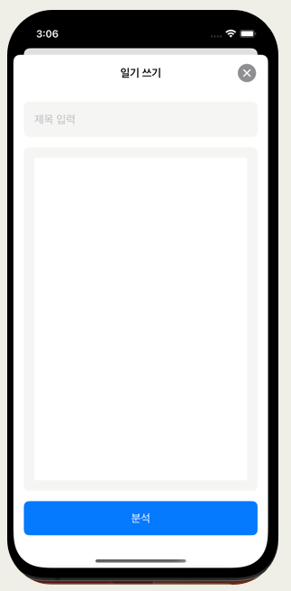
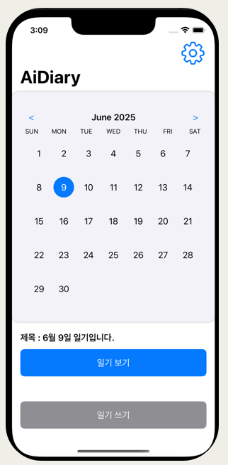
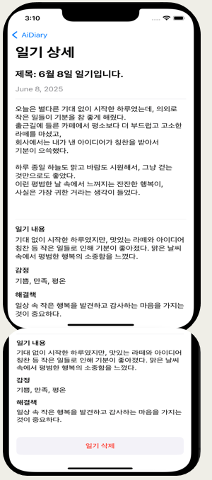
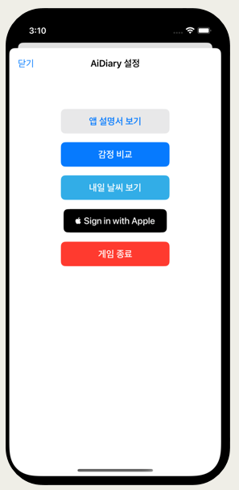
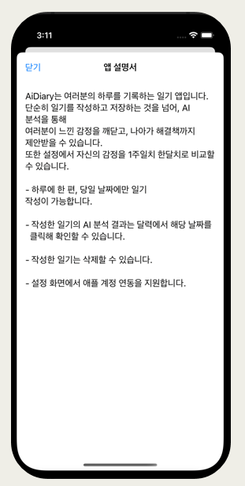
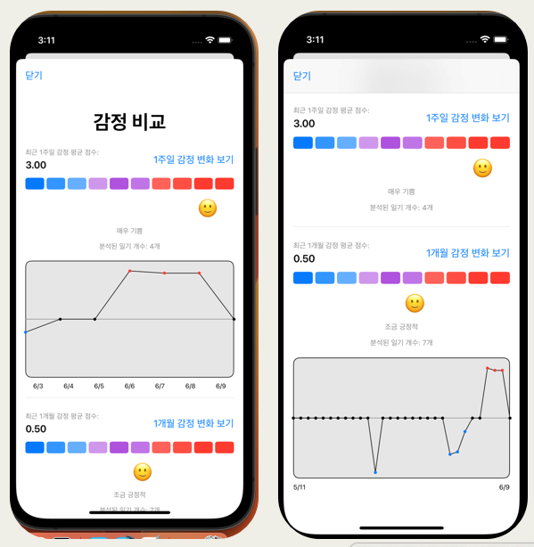
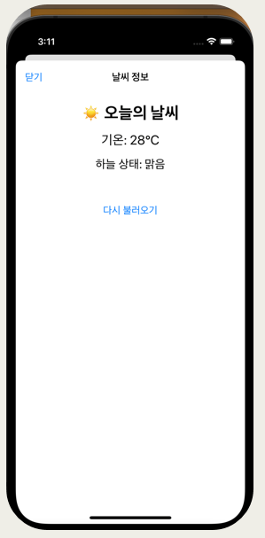

# 🧠 AI Diary

AI Diary는 사용자가 하루 동안 작성한 일기를 바탕으로 감정을 분석해주고, 이를 시각적으로 확인할 수 있도록 돕는 **감정 분석 기반 일기 앱**입니다.  
심리 상태를 추적하고 자기 성찰을 도와주는 기능을 중심으로 설계되었습니다.

---

## 🎯 목표 사용자

- 자신의 심리 상태를 돌아보고 싶은 사람들  
- 꾸준히 자기성찰, 기록을 하고 싶은 사람들  
- 정신 건강에 관심 있는 사람들  
- 감정 추이를 그래프로 보고 싶은 사람들  

---

## ⚙️ 개발 환경

- **플랫폼**: iOS (iPhone / iPad)  
- **언어**: Swift  
- **UI 프레임워크**: SwiftUI  
- **IDE**: Xcode  
- **AI API**: Gemini API  
- **DB**: Core Data  
- **외부 API**: 공공데이터포털, Gemini  

---

## 📅 메인 화면

- 날짜를 클릭하면 해당 날짜 일기 확인  
- "일기 쓰기" 버튼은 당일에만 활성화  
- 우측 상단 톱니 → 설정화면으로 이동

---

## ✍️ 일기 작성 화면

- 제목 미입력 시 자동으로 `OO월 OO일 일기입니다`로 저장됨  
- 분석 버튼 클릭 시 JSON 형식으로 Gemini API에 전송 → 감정 분석 후 저장됨  

---

## 📅 일기를 쓴 후 메인 화면

- 캘린더와 일기 쓰기 버튼 사이에 자신이 쓴 일기가 나타납니다. 

---

## 📖 일기 보기 및 상세 분석

- 작성한 일기는 캘린더 아래에 표시됨  
- 감정 분석 결과 및 해결 방안이 함께 제공됨  
- 일기 삭제 가능

---

## ⚙️ 설정 화면

- 앱 설명서 보기  
- 감정 비교 기능  
- 내일 날씨 보기  
- Apple 계정 연동  
- 앱 종료

---

## 📘 앱 설명서 화면

- 일기 작성, 감정 분석, 삭제, 연동 방법 등이 정리됨  
- 사용자에게 앱의 전반적인 사용법 안내

---

## 📊 감정 비교 화면

- 감정 점수: -4 (매우 부정) ~ +4 (매우 긍정)  
- 보라색 → 파란색일수록 부정 / 빨간색일수록 긍정  
- 분석된 감정은 점수화되어 그래프로 표시됨  
- 이모티콘으로 직관적인 감정 표현  
- 일기 미작성/중립 감정일 경우 검정 점으로 표시됨

---

## 🌦️ 날씨 확인 화면

- 공공데이터포털 API를 통해 실시간 날씨 표시  
- 오류 발생 시 ‘다시 불러오기’ 버튼으로 재시도 가능

---

## 🚀 주요 기능 요약

- AI 감정 분석 (Gemini API)
- 감정 트렌드 시각화 (그래프)
- 실시간 날씨 확인 (공공데이터 API)
- Apple 계정 연동
- 감정 비교, 해결책 제안
- 직관적인 UI (SwiftUI 기반)

---

## 🔮 향후 개선 사항

- 음성 인식 일기 작성  
- 챗봇과 감정 대화 기능  
- 시각적 자료 강화 (이모티콘, 컬러 차트)  
- 오늘의 운세 기능 추가  
- 정신건강 관련 추천 콘텐츠 제공 

---

## 🎥 앱 사용 시연 (GIF)

앱에서 일기를 작성하고 감정 분석 결과를 확인하는 흐름입니다.

